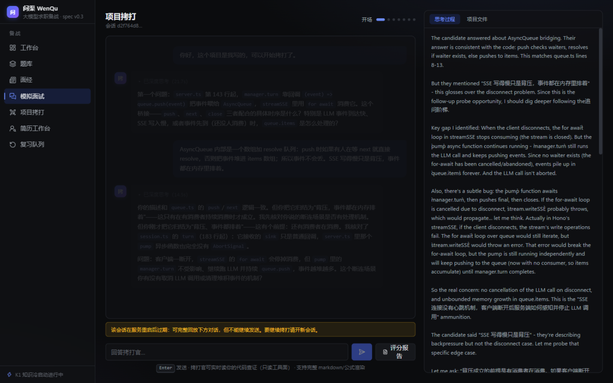
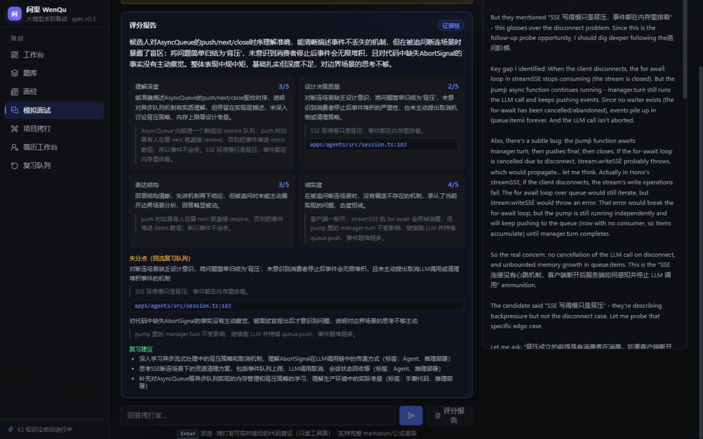
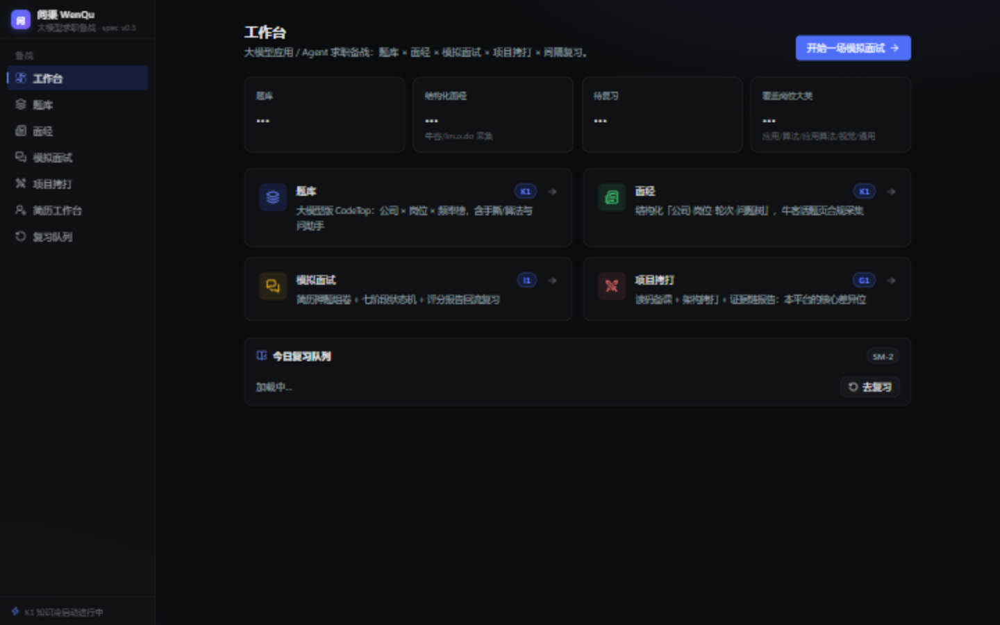
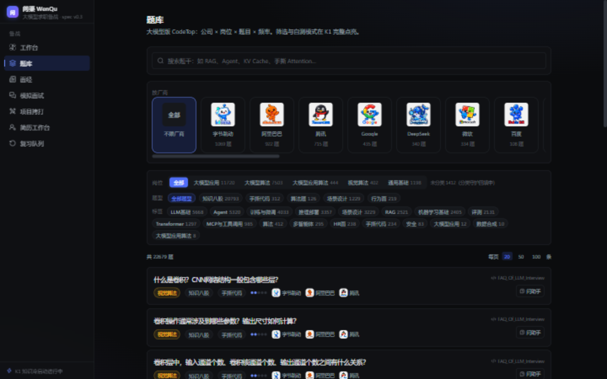
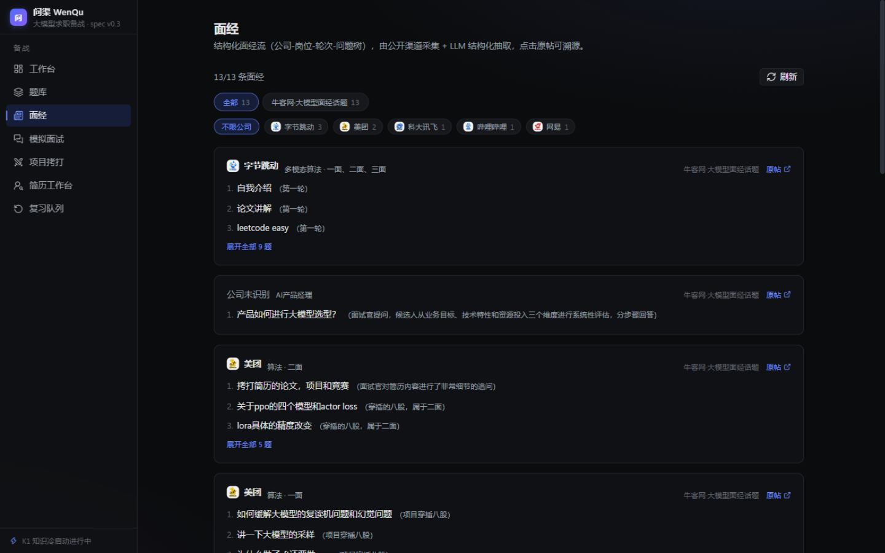
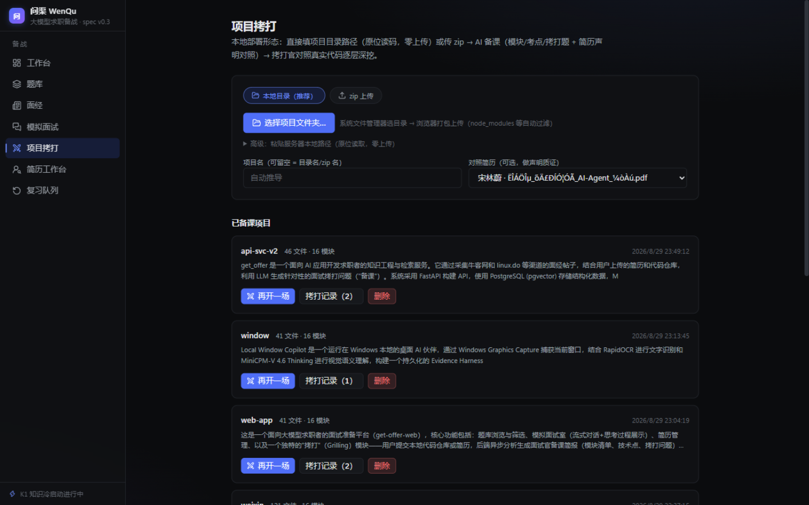
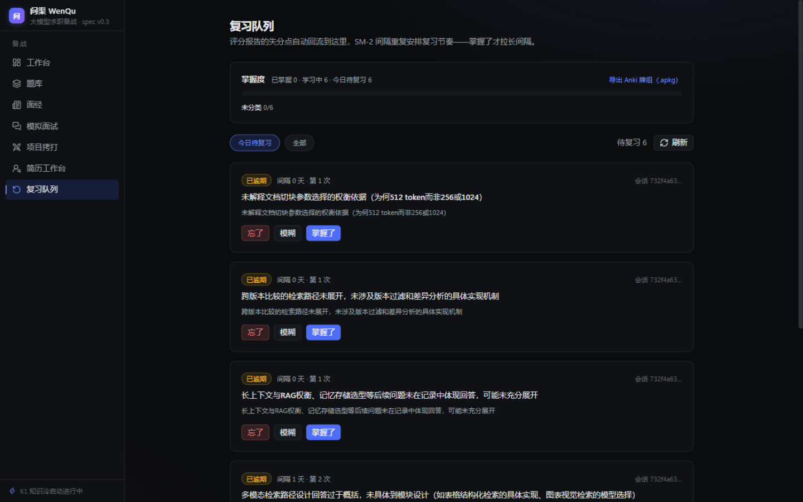
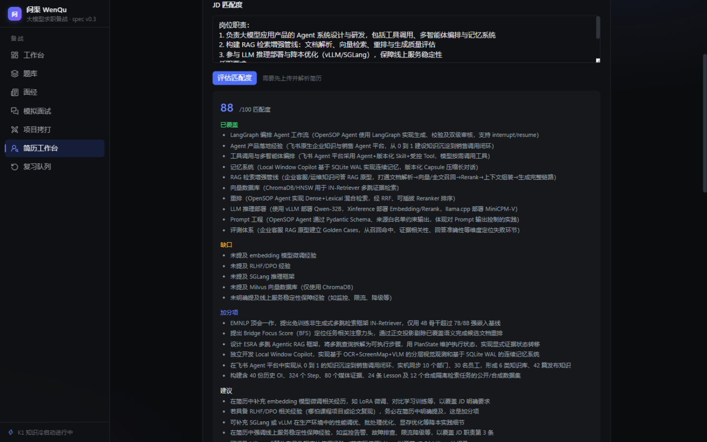

# 问渠 WenQu

> 问渠那得清如许，为有源头活水来。

**大模型应用 / AI Agent 方向求职备战平台**——面经知识库、厂商题库、AI 考官模拟面试、**项目读码拷打**、间隔复习闭环，一站式本地部署。

[]() []() []()

## 为什么是问渠

求职大模型应用岗的痛点：八股题库烂大街，但**面试官真正拷打的是你简历上的项目**——"这个模块怎么实现的？为什么不用 X 方案？为什么没做 Y？"。市面上没有一款产品能读懂你的仓库再针对你提问（2026-08 复核仍是空白）。

问渠补上这块：

| 能力 | 一句话 |
|---|---|
| 🗂️ **题库 22,000+** | 11 个开源源（license 门禁）+ LeetCode Hot100；公司 × 岗位 × 频率榜 |
| 📰 **真实面经** | 牛客话题页合规采集 → LLM 结构化「公司-岗位-轮次-问题树」 |
| 🎯 **简历押题面试** | 简历考点 × 公司面经追问 × 频率榜 → LLM 定卷 → 题单驱动模拟面试 |
| ⚔️ **项目拷打**（核心差异位） | 上传项目目录 → AI 备课（架构拷打题 + 简历声明质证）→ 拷打官**真读码**深挖，`文件:行号` 点击核证 |
| 🔗 **证据链报告** | 每条评分结论挂**你的原话 + 代码位置**证据，可点击回看现场 |
| 🔁 **间隔复习闭环** | 失分点自动回流 SM-2 → 掌握度统计 → 一键导出 Anki |

## 截图

### 项目拷打：读你的代码，拷打你的设计

拷打官对照真实代码提问（右栏实时思考过程 + 项目文件树），点击 `文件:行号` 引用直接在侧栏定位到那一行：



评分报告带证据链——每个维度、每条失分点都挂候选人原话与代码位置，失分点回流复习队列：



### 全景

| | |
|---|---|
|  |  |
| **工作台**：真实统计 + 模块导航 | **题库**：厂商瓷片 × 岗位大类 × 问助手 |
|  |  |
| **面经**：按来源分类 + 问题树 | **项目拷打**：目录选择 → 异步备课 → 随时再开一场 |
|  |  |
| **复习队列**：SM-2 + 掌握度 + Anki 导出 | **简历工作台**：画像 + JD 匹配度（匹配/缺口/建议） |

## 快速开始（Windows 本地部署）

```bat
1. git clone https://github.com/fjnuslw/WenQu && cd WenQu
2. 双击 setup.bat        # 工具链 + 依赖 + .env 样例
3. 编辑 appspi\.env   填 GETOFFER_LLM__API_KEY（DeepSeek）
   编辑 appsgents\.env 填 DEEPSEEK_API_KEY
4. 双击 start.bat        # docker 基础设施 + 三服务，健康检查就绪
5. 打开 http://127.0.0.1:23482
```

- **模型**：DeepSeek-V4-Flash-Vision-Exp（思考流 max 档；答题/拷打的推理过程全程可见）
- **端口**：23480-23482（web/api/agents），24432/27700/26379（pg/meili/redis）——冷门段，启动自动清障
- **断网环境**：`.env` 可配 `GETOFFER_GIT_PROXY` / `GETOFFER_COLLECT_PROXY`

## 架构

```
        ┌────────────── 浏览器（Next.js 16，暗色优先）──────────────┐
        │  题库/面经/面试/拷打/简历/复习 —— 同源代理（SSE 逐块流式）    │
        └──────┬─────────────────────────────┬────────────────────┘
        REST /api│                        SSE /agents│
   ┌────────────┴───────────┐      ┌───────────────┴────────────────┐
   │ apps/api · FastAPI      │      │ apps/agents · Node + pi 运行时   │
   │ 知识管道（采集/抽取/检索）│ 内部  │ 面试 agent（状态机+追问阶梯）     │
   │ 组卷/报告/复习/统计      │◄────►│ 拷打 agent（只读工具面+路径监狱） │
   └──┬──────┬──────┬───────┘      │ 答题 agent（web_search+max 思考）│
   Postgres  Meili  Redis           └───────────────┬────────────────┘
   +pgvector (CJK) (arq)                    OpenAI 兼容│
                                              ┌───────┴────────┐
                                              │ DeepSeek API    │
                                              └────────────────┘
```

技术选型与工程原则（禁正则硬编码解析、禁静默 fallback、append-only JSONL 会话、类型化错误族、幂等管道）见 **[docs/spec.md](docs/spec.md)**；竞品与数据渠道调研见 **[research/](research/)**。

## 复用与致谢

Agent 运行时复用 [pi-agent-core / pi-ai](https://github.com/earendil-works/pi)（MIT）；架构思想参考 [DeepSeek Harness](https://github.com/deepseek-ai/deepseek-harness)（插件化）、[deepwiki-open](https://github.com/AsyncFuncAI/deepwiki-open)（repo 理解）、[The-Interview-Mentor](https://github.com/ps06756/The-Interview-Mentor)（阶段机+rubric）、aider repomap（Apache-2.0）。题库源遵守各自 license（MIT/Apache 答案底稿、无 license 仅题干、GPL 禁入，见 spec §10）。

## Roadmap

- [x] K1 题库与面经知识核心（22,679 题 + 合规采集管道）
- [x] I1 模拟面试循环（简历押题组卷 → 评分报告 → 失分回流）
- [x] G1 项目拷打 v1（备课/只读工具面/证据链报告）
- [x] L1 学习闭环（SM-2/掌握度/Anki/JD 匹配）
- [ ] 语音面试（浏览器语音输入 + TTS 朗读）
- [ ] G1 v2（tree-sitter repo map / pgvector 语义检索 / git 归属分析）
- [ ] 面经 → 公司×题目频率榜校准

---

*个人求职备战项目，本地单用户形态优先；数据合规边界（robots/公开范围/license）内采集，详见 [spec §10](docs/spec.md)。*
