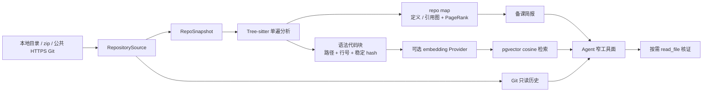

# 问渠 · WenQu

> 为大模型应用 / AI Agent 求职者打造的本地化面试备战工作台。

问渠不是“再做一个八股题库”，而是把 **面经、题库、简历、项目代码、模拟面试和复习** 串成一条可追溯的训练闭环：

```text
面经与题库 ──► 个性化组卷 ──► 模拟面试 ──► 项目读码拷打 ──► 证据链报告 ──► SM-2 复习
      ▲                                                        │
      └────────────────────── 掌握度与学习路径 ◄───────────────┘
```

[](LICENSE)
[](docs/spec.md)
[](apps/api/pyproject.toml)
[](apps/web/package.json)
[](docs/spec.md)

## 先看四个关键看点

| 看点 | 问渠怎么做 | 你最终拿到什么 |
|---|---|---|
| **针对你，而不是针对平均候选人** | 公司 × 岗位 × 频率榜与简历考点联合组卷，题单由 Harness 严格推进 | 一场有目标、有顺序、有追问上限的模拟面试 |
| **项目拷打必须落到证据** | 项目备课、Tree-sitter repo map、只读读码、简历声明质证、`文件:行号` 锚点 | 面试官为什么追问、代码在哪里、回答缺了什么 |
| **训练结果可以继续使用** | 评分报告提炼失分点，回流 SM-2，按标签统计掌握度并导出 Anki | 下一次复习不是重新开始，而是接着薄弱点练 |
| **本地优先、边界清楚** | API / Agent / Web 三服务，数据与 API Key 留在本机；Agent 只有窄化的只读工具面 | 可审计、可复现、适合个人长期积累的工作台 |

## 完整能力导览

以下顺序就是一次完整使用路径。每个模块都有独立入口，也可以单独使用：

| 模块 | 入口 | 演示重点 |
|---|---|---|
| **工作台** | `/` | 题库、面经、模拟面试、项目拷打、复习和学习路径的总览与今日行动 |
| **题库** | `/bank` | 厂商 / 岗位 / 题型 / 标签筛选，支持算法题与手撕场景，题目保留来源与溯源信息 |
| **面经** | `/experiences` | 公开来源结构化为公司 × 岗位 × 轮次 × 问题树，保留原始链接，支持公司频率校准 |
| **模拟面试** | `/interview` | 简历考点 + 公司面经组卷，中文展示层、追问阶梯、状态机、评分报告和证据回流 |
| **项目拷打** | `/grilling` | 本地目录 / zip / 公共 HTTPS Git；备课后按需读码，支持 repo map、语义检索和 Git 归属 |
| **简历工作台** | `/resume` | 简历结构化、候选人画像、JD 匹配度、已覆盖能力 / 缺口 / 建议 |
| **复习队列** | `/review` | 评分失分点进入 SM-2 队列，三键复习反馈，掌握度统计，一键导出 `.apkg` |
| **学习路径** | `/paths` | 应用 / 算法 / 开发 / 手撕五条线，资源锚点复检，订阅与节点进度持久化 |

## 项目拷打：当前版本的核心差异

项目拷打不是把仓库全文塞进 Prompt，而是分层提供证据：



Agent 默认只看到三个基础工具：`list_files`、`read_file`、`search_code`。当项目能力清单确认可用时，才动态注册：

- `get_repo_map`：先找架构中心与关键符号；
- `semantic_search`：不知道函数名时按职责定位代码（未配置 Provider 时不会出现）；
- `get_git_ownership`：只在需要核实候选人贡献时查看历史，不把提交量直接当能力结论。

当前 G1 v2 的代码模块已经收口，真实 embedding Provider 发布验收仍单独保留为环境门，详见 [IMP-G1-001](docs/improvement-specs/IMP-G1-001-repository-intelligence-v2.md)。

## 验收基线

最近一次真实运行结果（工作树包含在证据中）：

- Tree-sitter：当前仓库 232 个快照文件，177/177 个受支持源码文件解析成功，370 个语法代码块，repo map 3,004 条引用边；
- pgvector：真实 PostgreSQL/pgvector 写入 370 个真实代码块并完成 cosine 查询，目标实现文件进入 Top-5；当前 Provider=disabled，因此不把 fixture 向量宣称为语义质量；
- Git：公共 `https://github.com/pallets/itsdangerous.git` 全流程通过，15/15 受支持源码解析，200 条提交历史归属分析；
- 回归：API 121 tests + ruff，Agents 29 tests + typecheck，Web 5 tests + typecheck + production build；三项服务健康检查均为 200。

详细证据：[G1 验收基线](apps/api/evals/g1-repository-intelligence-baseline.json) · [总规范](docs/spec.md) · [改进 Spec 索引](docs/improvement-specs/README.md)

## 快速开始

### 环境要求

| 依赖 | 版本 | 用途 |
|---|---|---|
| Docker Desktop | 任意近期版本 | PostgreSQL / pgvector、Meilisearch、Redis |
| Node.js | 22+ | Web 与 Agents |
| Python | 3.12+ | API |
| uv | 最新版 | Python 依赖管理 |
| DeepSeek API Key | — | 面试、备课、评分等 LLM 能力 |

### Windows 一键启动

```bat
git clone https://github.com/fjnuslw/WenQu.git
cd WenQu

:: 双击或执行：安装工具链、依赖与 .env 样例
setup.bat

:: 分别填写 apps/api/.env 与 apps/agents/.env 中的 API Key
:: 然后启动 Docker 基础设施与三项服务
start.bat
```

打开 <http://127.0.0.1:23482>。

停止、状态检查和日志：

```bat
stop.bat
status.bat
```

### 手动部署（macOS / Linux）

```bash
docker compose up -d

cd apps/api && uv sync
uv run uvicorn getoffer.api.main:create_app --factory --port 23480

cd ../agents && npm install && npm run dev
cd ../web && npm install && npm run dev
```

## 配置与数据边界

配置分为 API 与 Agents 两个 `.env`，模板见 [apps/api/.env.example](apps/api/.env.example) 和 [apps/agents/.env.example](apps/agents/.env.example)。`.env`、数据库和本地导入数据不会进入 Git。

| 配置 | 默认 / 说明 |
|---|---|
| `GETOFFER_LLM__API_KEY` | API 侧 LLM Key；为空时服务仍启动，但 LLM 功能显式返回未配置 |
| `DEEPSEEK_API_KEY` | Agents 侧 Key，与 API 侧可使用同一 Key |
| `GETOFFER_TTS__PROVIDER` | `disabled`（默认）或已配置的语音 Provider |
| `GETOFFER_EMBEDDING__PROVIDER` | `disabled`（默认）或 `openai_compatible`；与聊天 LLM 完全分离 |
| `GETOFFER_GIT_PROXY` / `GETOFFER_COLLECT_PROXY` | 网络受限时填写代理 |

题库与面经需要自行导入：

```bat
cd apps/api
uv run python scripts/import_source.py --all
uv run python scripts/backfill_company_freq.py
```

导入器带幂等设计，License 门禁拒绝 GPL / AGPL / NC 内容进入库内。第三方内容的使用合规责任由使用者承担。

## 工程结构

```text
apps/
  api/      FastAPI：采集、解析、组卷、报告、复习、统计、仓库智能层
  agents/   Node + pi：mock / grill / answer 三类 Agent 与 SSE 会话
  web/      Next.js：工作台、题库、面经、面试、拷打、简历、复习、路径
docs/       规格、改进 Spec、验收基线与演示文档
research/   竞品、数据渠道、Agent Harness 与仓库理解调研
scripts/    Windows 一键启停与状态脚本
```

设计原则：模块边界清晰、禁止静默 fallback、类型化错误、append-only 会话日志、幂等管道、所有代码证据保留路径与行号。实现细节见 [docs/spec.md](docs/spec.md)。

## Roadmap

- [x] K1 知识核心：题库、面经、标签、公司频率榜与合规导入
- [x] I1 模拟面试：简历押题组卷、追问阶梯、评分报告、失分回流
- [x] G1 项目拷打 v1：备课、只读工具、代码证据链报告
- [x] L1 学习闭环：SM-2、掌握度、Anki、JD 匹配
- [x] F7 学习路径：五条线、资源锚点、订阅与进度
- [ ] G1 v2 发布门：配置真实 embedding Provider 后完成自然语言 Top-5 质量验收
- [ ] README v2 演示图：以当前界面重新实测，统一新设计并对姓名、联系方式、文件名等敏感信息脱敏

## 复用与致谢

Agent 运行时复用 [pi-agent-core / pi-ai](https://github.com/earendil-works/pi)（MIT）；设计思想参考 [DeepSeek Harness](https://github.com/deepseek-ai/deepseek-harness)、[deepwiki-open](https://github.com/AsyncFuncAI/deepwiki-open)、[The-Interview-Mentor](https://github.com/ps06756/The-Interview-Mentor) 与 aider repomap。题库来源遵守各自 License。

## License 与免责声明

代码使用 [MIT License](LICENSE)。本项目是个人学习用途的本地单用户 MVP，没有多租户、认证与限流，请勿直接部署为公开服务。AI 面试、评分、押题和拷打结果仅供训练参考；重要决策不要依赖单一模型输出。
