<p align="center">
  
</p>

<h1 align="center">问渠 · WenQu</h1>

<p align="center">
  面向大模型应用 / AI Agent 岗位的本地化求职训练平台<br/>
  把题库、面经、简历、真实代码、模拟面试、评分与复习连成一条可追溯闭环
</p>

<p align="center">
  <a href="LICENSE"></a>
  
  <a href="apps/api/pyproject.toml"></a>
  <a href="apps/web/package.json"></a>
  <a href="apps/api/evals/g1-repository-intelligence-baseline.json"></a>
</p>

## 产品定位

问渠以候选人的简历、目标岗位和真实项目为上下文，提供从知识准备到面试复盘的完整训练闭环。

- 简历证据与岗位要求共同驱动组卷和追问。
- 代码、原话与评分结论均可定位、可核验。
- Knowledge、Resume、Interview、Repository、Review 模块通过窄契约协作，可独立替换与优化。

## 能力架构

<p align="center">
  
</p>

## 产品演示

演示环境使用合成候选人、简历、岗位描述与训练记录。

### 1. 统一工作台

<p align="center">
  <a href="docs/screenshots/hd/01-dashboard.png">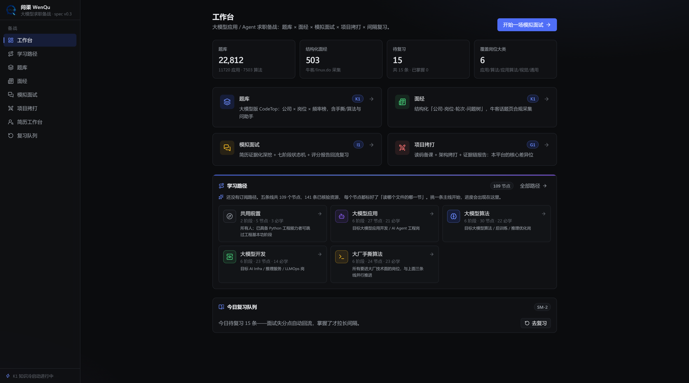</a>
</p>

<p align="center"><sub>题库、面经、复习任务与学习路径统一总览</sub></p>

### 2. 学习路径

<p align="center">
  <a href="docs/screenshots/hd/02-learning-task.png">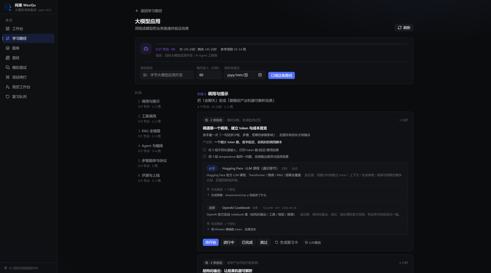</a>
</p>

<p align="center"><sub>109 个任务节点与 141 个已核验资源，覆盖产出物、验收标准和掌握进度</sub></p>

### 3. 题库与答题助手

<p align="center">
  <a href="docs/screenshots/hd/03-question-bank-rag.png">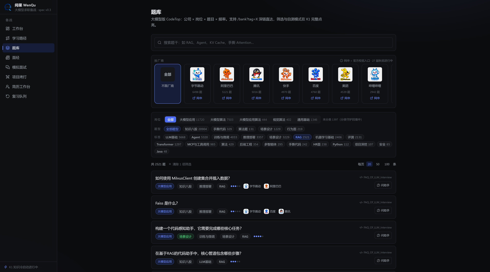</a>
</p>

<p align="center"><sub>按公司、岗位、题型和标签联合筛选，保留来源</sub></p>

<p align="center">
  <a href="docs/screenshots/hd/04-question-assistant.png">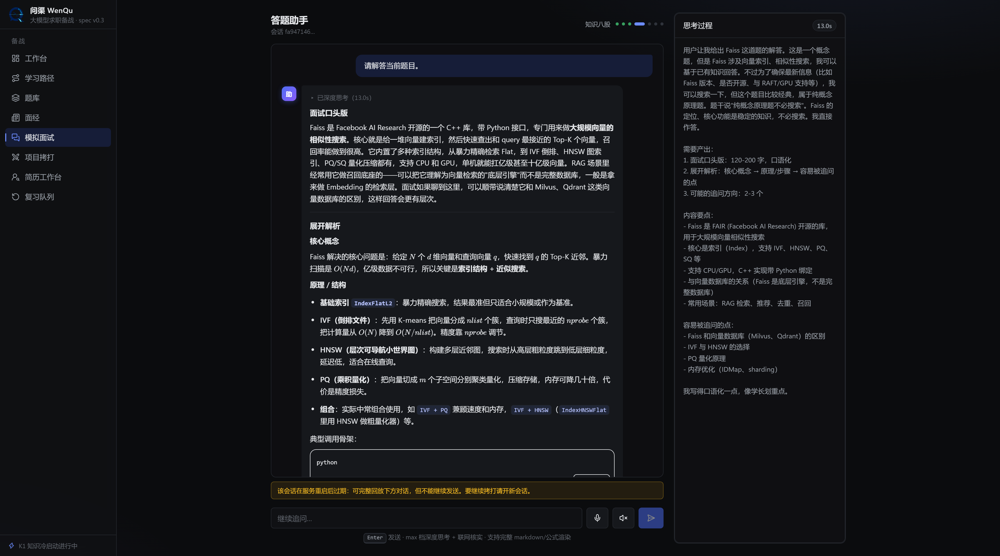</a>
</p>

<p align="center"><sub>面试口述、原理、公式与追问一体化生成</sub></p>

### 4. 结构化面经

<p align="center">
  <a href="docs/screenshots/hd/05-experiences-meituan.png">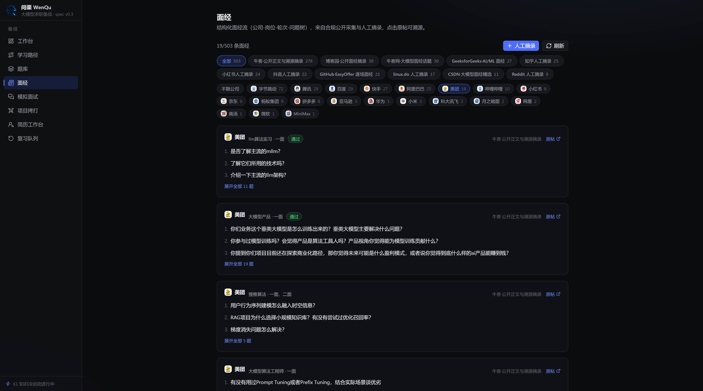</a>
</p>

<p align="center"><sub>按公司、岗位与轮次组织问题，支持来源回溯</sub></p>

### 5. 个性化模拟面试

<p align="center">
  <a href="docs/screenshots/hd/06-interview-deep-dive-voice.png">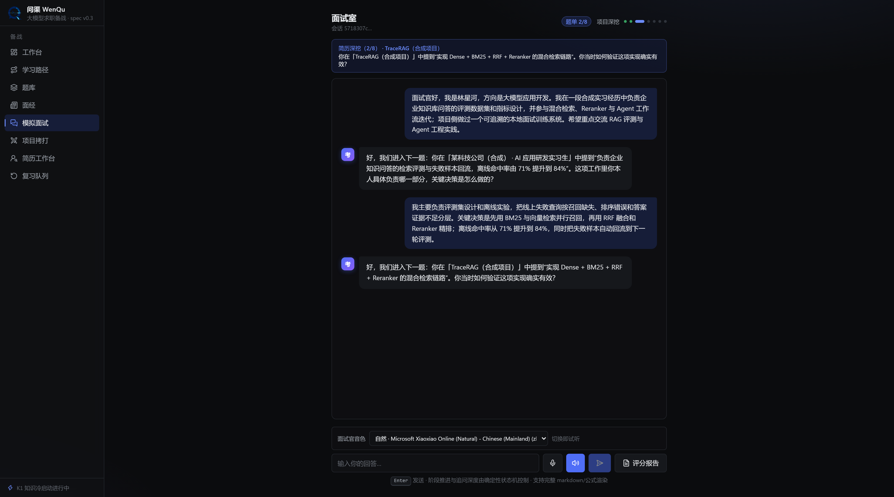</a>
</p>

<p align="center"><sub>中文场景、简历深挖、阶段化追问与跨浏览器音色适配</sub></p>

### 6. 代码证据驱动的项目拷打

<p align="center">
  <a href="docs/screenshots/hd/07-grill-repo-evidence.png">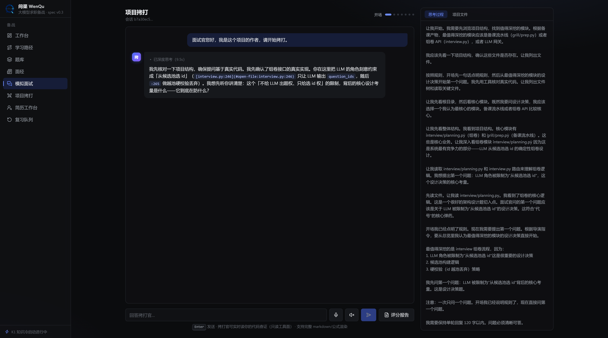</a>
</p>

<p align="center"><sub>基于仓库结构与关键文件生成可核验的架构问题</sub></p>

<p align="center">
  <a href="docs/screenshots/hd/08-repository-code-evidence.png">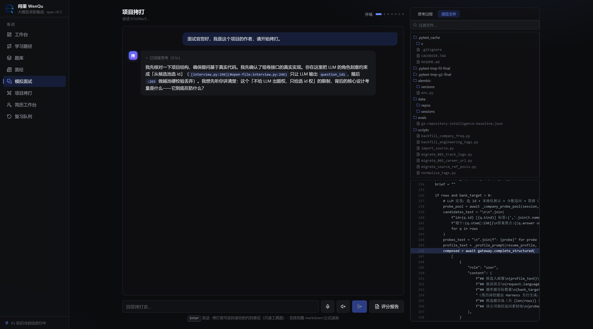</a>
</p>

<p align="center"><sub>问题、证据文件与源码行号直接关联</sub></p>

| 能力 | 实现 | 失败时的行为 |
|---|---|---|
| 结构地图 | Tree-sitter 单遍分析，定义 / 引用图 + PageRank | 只对受支持语言启用，不伪造结构结果 |
| 语义定位 | 稳定代码块 + 独立 embedding Provider + pgvector cosine | Provider 未配置时不注册 `semantic_search` |
| 贡献核验 | 只读 Git 历史、贡献者与候选人归属摘要 | 非 Git / shallow 状态显式标注，不把提交量当能力结论 |
| 现场查证 | `list_files` / `read_file` / `search_code` + `文件:行号` | 只读、限根目录、限返回预算 |

### 7. 简历与岗位匹配

<p align="center">
  <a href="docs/screenshots/hd/09-resume-jd-synthetic.png">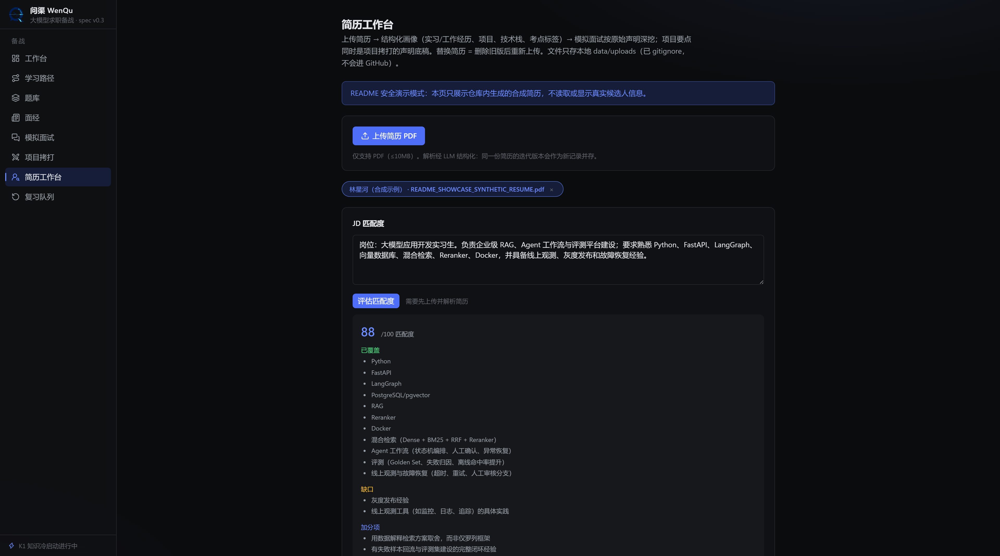</a>
</p>

<p align="center"><sub>基于简历证据识别匹配项、能力缺口与修改建议</sub></p>

### 8. 评分与复习闭环

<p align="center">
  <a href="docs/screenshots/hd/11-evidence-report-synthetic.png">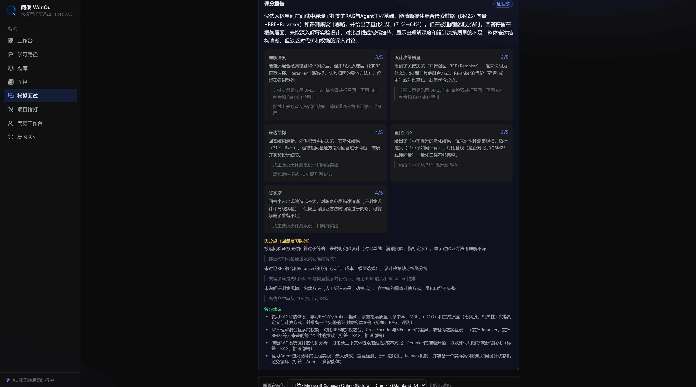</a>
</p>

<p align="center"><sub>评分维度、原话证据、失分项与改进建议</sub></p>

<p align="center">
  <a href="docs/screenshots/hd/10-review-sm2-synthetic.png">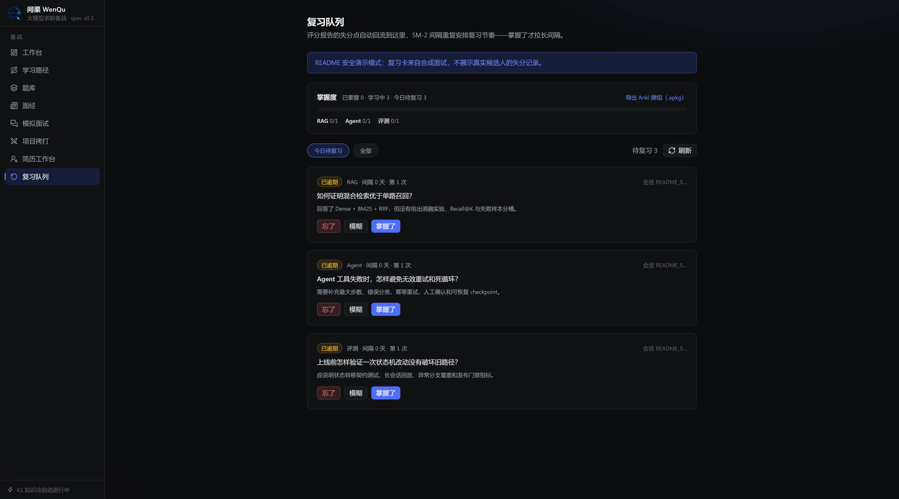</a>
</p>

<p align="center"><sub>SM-2 复习、掌握度统计与 Anki 导出</sub></p>

## 工程边界

```text
apps/
  api/      FastAPI：知识管道、组卷、简历、报告、复习、Repository Intelligence
  agents/   Node + pi：mock / grill / answer 三类 Agent、Harness、SSE 会话与只读工具
  web/      Next.js：八个可独立进入的产品模块与浏览器语音适配

scripts/    Windows 一键安装、启动、停止、状态与日志
```

核心原则：**窄契约、显式失败、append-only 会话、幂等管道、可定位证据、本地数据不进 Git**。

## 验收基线

- API：121 tests + Ruff；Agents：29 tests + typecheck；Web：5 tests + typecheck + production build。
- Tree-sitter：177/177 个受支持源码文件解析成功，370 个语法代码块，repo map 3,004 条引用边。
- pgvector：370 个真实代码块完成写入与 cosine 查询；fixture 向量只证明链路，不冒充真实语义质量。
- Git：公共 `itsdangerous` 仓库 15/15 个受支持源码解析，200 条提交历史完成归属分析。
- 三项服务健康检查均为 200。

机器可读证据：[G1 验收基线](apps/api/evals/g1-repository-intelligence-baseline.json)。

> 发布前需配置真实 embedding Provider，并完成自然语言 Top-5 检索质量验收；未配置时该能力明确标记为 unavailable。

## 快速开始

### 环境要求

| 依赖 | 版本 | 用途 |
|---|---|---|
| Docker Desktop | 近期版本 | PostgreSQL / pgvector、Meilisearch、Redis |
| Node.js | 22+ | Web 与 Agents |
| Python | 3.12+ | API |
| uv | 近期版本 | Python 依赖管理 |
| DeepSeek API Key | — | 面试、备课、评分等 LLM 能力 |

### Windows

```bat
git clone https://github.com/fjnuslw/WenQu.git
cd WenQu

setup.bat
:: 填写 apps/api/.env 与 apps/agents/.env
start.bat
```

打开 <http://127.0.0.1:23482>。状态检查、日志与停止：

```bat
status.bat
stop.bat
```

### macOS / Linux 手动启动

```bash
docker compose up -d

cd apps/api && uv sync
uv run uvicorn getoffer.api.main:create_app --factory --port 23480

cd ../agents && npm install && npm run dev
cd ../web && npm install && npm run dev
```

## 配置与数据边界

模板见 [apps/api/.env.example](apps/api/.env.example) 与 [apps/agents/.env.example](apps/agents/.env.example)。`.env`、数据库、上传简历和本地导入数据均被 Git 忽略。

| 配置 | 默认 / 说明 |
|---|---|
| `GETOFFER_LLM__API_KEY` | API 侧 LLM Key；为空时服务仍能启动，相关调用返回显式未配置 |
| `DEEPSEEK_API_KEY` | Agents 侧 Key，可与 API 侧复用 |
| `GETOFFER_TTS__PROVIDER` | `disabled` 或已配置的真实语音 Provider；浏览器语音是显式回退 |
| `GETOFFER_EMBEDDING__PROVIDER` | `disabled` 或 `openai_compatible`，与聊天模型完全分离 |
| `GETOFFER_GIT_PROXY` / `GETOFFER_COLLECT_PROXY` | 网络受限时填写代理 |

题库与面经需自行导入：

```bat
cd apps/api
uv run python scripts/import_source.py --all
uv run python scripts/backfill_company_freq.py
```

导入器幂等，License 门禁拒绝 GPL / AGPL / NC 内容进入库内。第三方内容的使用合规责任由使用者承担。

## 路线图

- [x] K1：题库、面经、标签、公司频率榜与合规导入
- [x] I1 / F3：简历证据化组卷、中文展示、追问阶梯、音色选择、评分回流
- [x] G1 v1：项目备课、只读工具、代码证据链报告
- [x] G1 v2：Tree-sitter repo map、pgvector 检索链路、Git 归属分析与动态能力注册
- [x] L1：SM-2、掌握度、Anki、JD 匹配
- [x] F7：五条学习路径、资源锚点、订阅与节点进度
- [x] 产品文档与合成数据演示资产
- [ ] 发布环境门：真实 embedding Provider 自然语言 Top-5 质量验收

## 复用与致谢

Agent 运行时复用 [pi-agent-core / pi-ai](https://github.com/earendil-works/pi)（MIT）；设计思想参考 [DeepSeek Harness](https://github.com/deepseek-ai/deepseek-harness)、[deepwiki-open](https://github.com/AsyncFuncAI/deepwiki-open)、[The-Interview-Mentor](https://github.com/ps06756/The-Interview-Mentor) 与 aider repo map。

## License 与免责声明

[MIT License](LICENSE)。本项目是本地单用户 MVP，没有多租户认证与公开服务限流，请勿直接暴露到公网。AI 面试、评分、押题和项目拷打仅供训练参考；重要决策不要依赖单一模型输出。
