<p align="center">
  
</p>

<h1 align="center">问渠 · WenQu</h1>

<p align="center">
  面向大模型应用 / AI Agent 岗位的本地化求职训练平台<br/>
  把题库、面经、简历、真实代码、模拟面试、评分与复习连成一条可追溯闭环
</p>

<p align="center">
  <a href="LICENSE"></a>
  <a href="docs/spec.md"></a>
  <a href="apps/api/pyproject.toml"></a>
  <a href="apps/web/package.json"></a>
  <a href="docs/improvement-specs/IMP-G1-001-repository-intelligence-v2.md"></a>
</p>

## 为什么做问渠

多数面试工具只解决一个局部问题：背题、聊天或简历打分。问渠更关心一次训练能不能留下可复用的证据：

- **问题必须针对你。** 先读简历里的实习、项目与量化声明，再结合目标公司面经和高频题组卷。
- **追问必须落到事实。** 项目拷打可按需打开真实仓库，用 repo map、语义检索、Git 归属和 `文件:行号` 核证。
- **结果必须进入下一轮。** 评分报告把具体失分点回流到 SM-2，而不是给一个看完就丢的总分。
- **模块必须能独立进化。** Knowledge / Resume / Interview / Repository / Review 通过窄契约协作，任何模块都能单独替换、评测和优化。

## 一张图看懂能力闭环

<p align="center">
  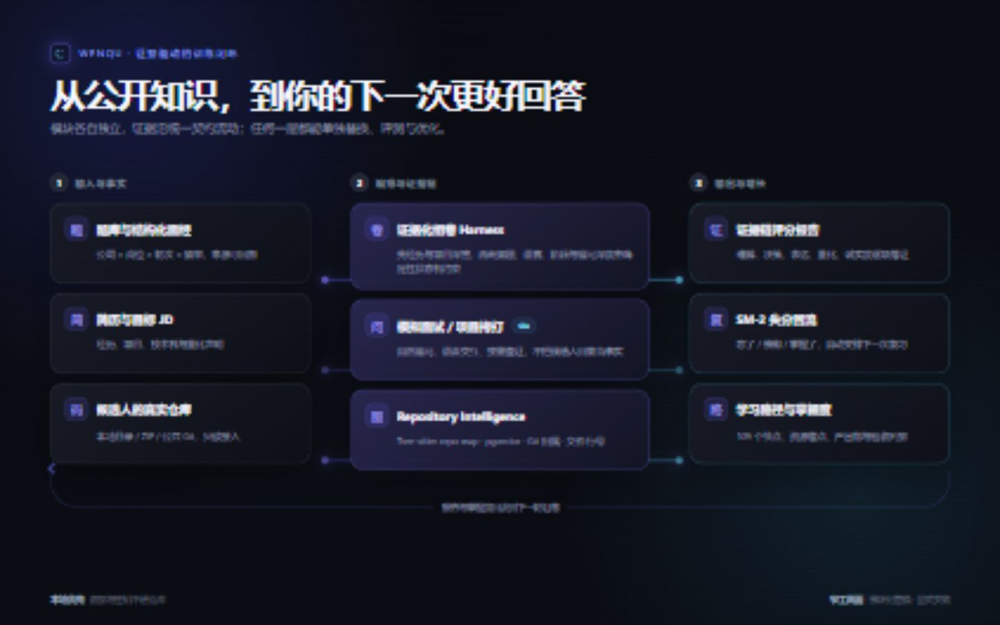
</p>

## 当前版本：真实任务演示

下列图片均在 **2026-09-02** 使用当前生产构建重新操作并截取，统一为 1440×900 暗色界面；不复用旧图。简历与复习模块启用了 `?showcase=1`，只显示仓库生成的合成候选人、合成 JD 和合成失分卡。

### 1. 工作台：先知道今天该做什么

**任务示例：** 打开平台后同时确认题库规模、面经覆盖、今日复习量与五条学习路径，再从一个明确入口开始训练。

<p align="center">
  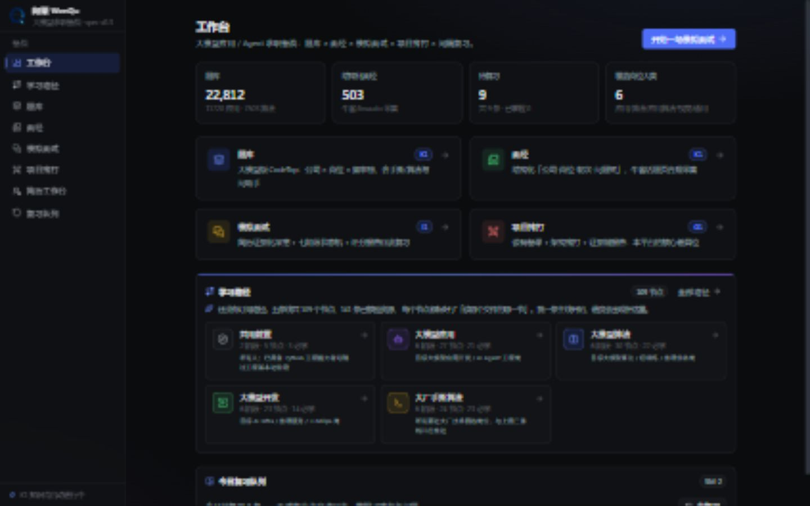
</p>

工作台不是导航页拼盘：它汇总题库与面经统计、SM-2 到期状态和路径进度，把“现在该做什么”放在首屏。

### 2. 学习路径：每个节点都有产出物和验收判据

**任务示例：** 完成“大模型应用 / 调用与提示”的第一个节点——对 5 组输入统计 token、首字延迟、总耗时和费用，并用 3 组 temperature 做对照实验。

<p align="center">
  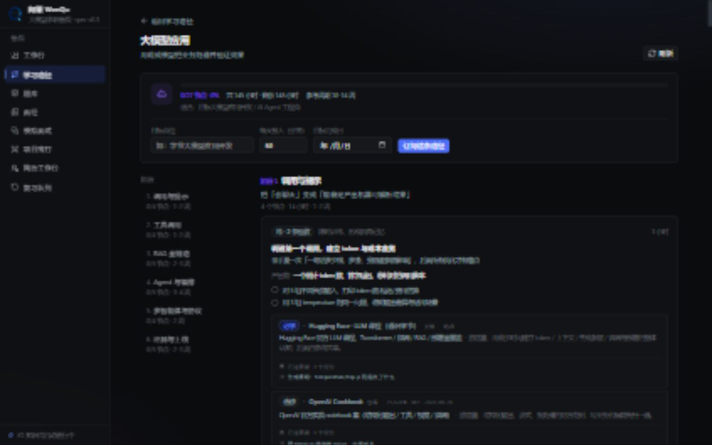
</p>

五条路径共 109 个节点、141 个已核验资源；节点包含目的、预计工时、产出物、逐项验收和可直达题库的考点标签，而不是一份链接收藏夹。

### 3. 题库与答题助手：从 2.2 万道题缩到当前考点

**任务示例：** 用 `RAG` 标签从 22,812 道题中筛出 2,521 道，再进入“问助手”，获得面试口头版、原理展开、公式、易错点和可能追问。

<table>
  <tr>
    <td width="50%">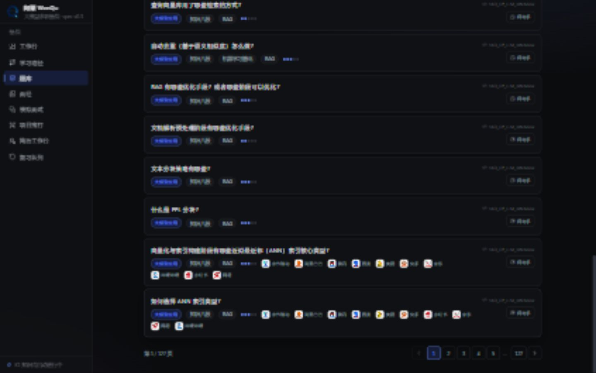</td>
    <td width="50%">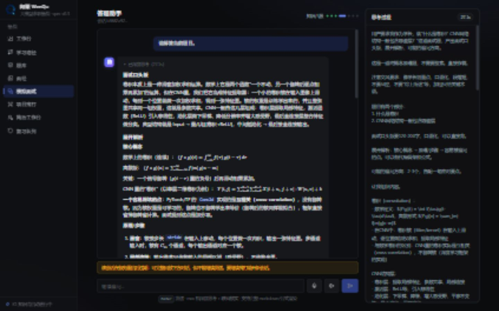</td>
  </tr>
  <tr>
    <td align="center"><sub>厂商 / 岗位 / 题型 / 标签联合筛选，保留来源</sub></td>
    <td align="center"><sub>口头版 → 原理 → 公式 → 追问，不只给标准答案</sub></td>
  </tr>
</table>

### 4. 结构化面经：看真实轮次如何追问项目

**任务示例：** 筛选“美团”，对比大模型实习、Agent 开发、搜推算法等岗位的一面 / 二面问题树，点“原帖”回溯公开来源。

<p align="center">
  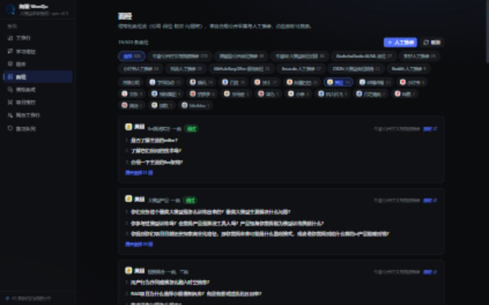
</p>

面经被拆成公司、岗位、轮次、结果和有序问题，不把英文公开题直接混入中文面试展示层；公司频率和追问素材可反向校准模拟面试。

### 5. 模拟面试：先深挖简历，再进入知识题

**任务示例：** 合成候选人声称“负责评测数据集和指标设计”。面试官没有随机切到八股，而是继续追问：覆盖哪些场景、指标如何计算、从多少提升到多少。

<p align="center">
  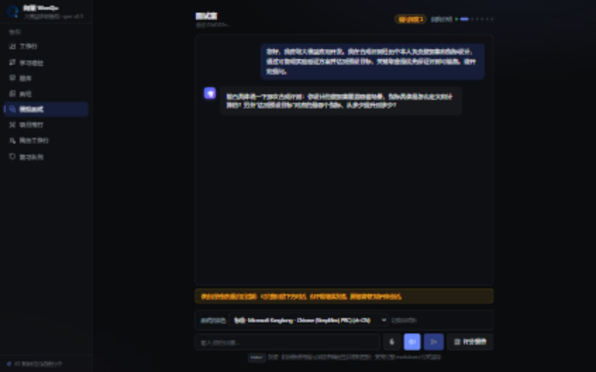
</p>

- 中文场景默认中文表达，只保留必要技术术语；English interview 是显式选择，不由题库原文语言决定。
- 七阶段状态机管理开场、自我介绍、项目深挖、知识八股、场景设计、反问和收尾，模型负责内容，Harness 负责边界。
- 语音优先使用已配置的服务端真实 TTS；未配置时读取浏览器可用音色，按语言和自然度排序，并允许切换即试听。截图中使用 Windows 浏览器回退音色，Chrome / Edge / 其他 Chromium 环境会按各自 `speechSynthesis` 清单适配。

### 6. 项目拷打：问题必须能回到真实代码

**任务示例：** 面试官发现 `prep.py:121-129` 用经验权重决定备课文件优先级，于是追问“为什么 README 权重更高、如何验证、冷门关键文件能否兜住”；右侧同时打开仓库树和对应源码。

<table>
  <tr>
    <td width="50%">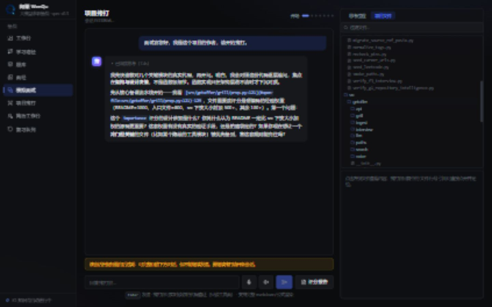</td>
    <td width="50%">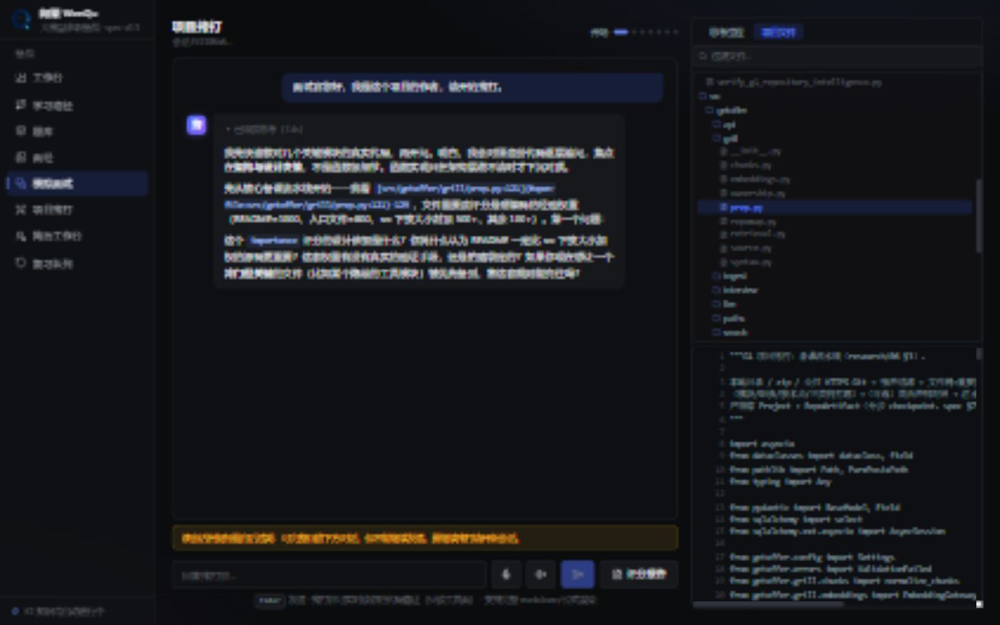</td>
  </tr>
  <tr>
    <td align="center"><sub>架构决策问题 + 可展开的真实文件树</sub></td>
    <td align="center"><sub>点击证据锚点，现场回到对应文件内容</sub></td>
  </tr>
</table>

G1 v2 将项目理解拆成四个可独立替换的能力：

| 能力 | 实现 | 失败时的行为 |
|---|---|---|
| 结构地图 | Tree-sitter 单遍分析，定义 / 引用图 + PageRank | 只对受支持语言启用，不伪造结构结果 |
| 语义定位 | 稳定代码块 + 独立 embedding Provider + pgvector cosine | Provider 未配置时不注册 `semantic_search` |
| 贡献核验 | 只读 Git 历史、贡献者与候选人归属摘要 | 非 Git / shallow 状态显式标注，不把提交量当能力结论 |
| 现场查证 | `list_files` / `read_file` / `search_code` + `文件:行号` | 只读、限根目录、限返回预算 |

### 7. 简历工作台：匹配结论必须有简历证据

**任务示例：** 用合成简历匹配一个“企业级 RAG + Agent”岗位。系统给出 88/100，并分开列出已覆盖能力、上线经验缺口、加分项和可执行修改建议。

<p align="center">
  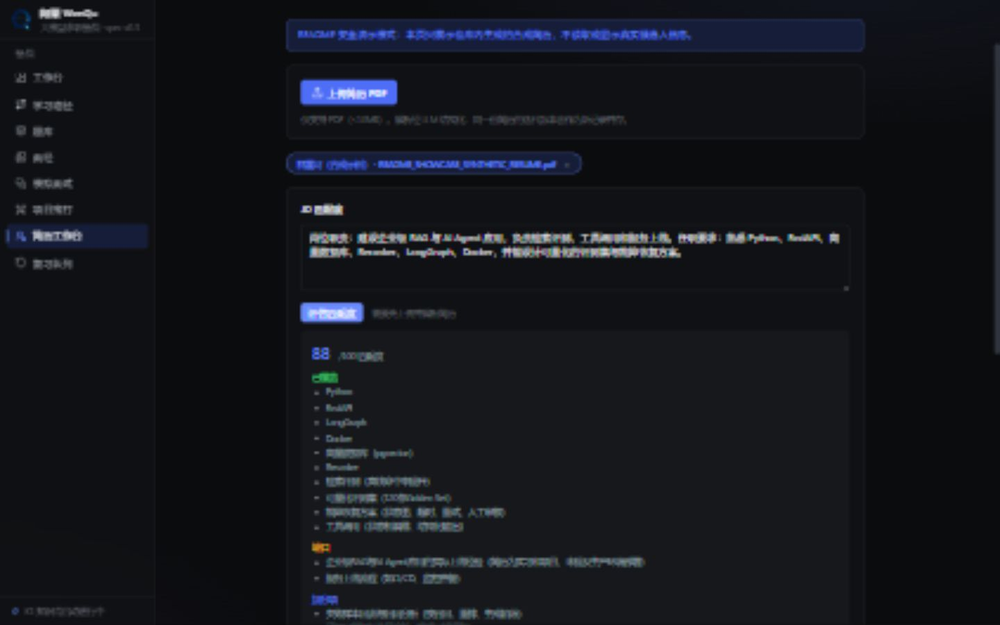
</p>

截图中的姓名、简历、公司、项目、指标和 JD 均为合成数据。`?showcase=1` 会过滤其他简历记录，README 生成过程不会读取或显示真实候选人信息。

### 8. 评分与复习：一次失分变成下一次训练

**任务示例：** 对上面的合成面试生成证据链报告，逐项评估理解深度、设计决策、表达、量化口径和诚实度；失分点随后进入 SM-2 队列。

<table>
  <tr>
    <td width="50%">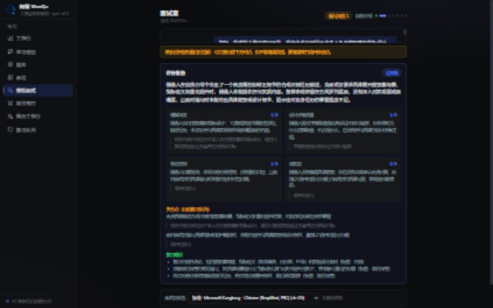</td>
    <td width="50%">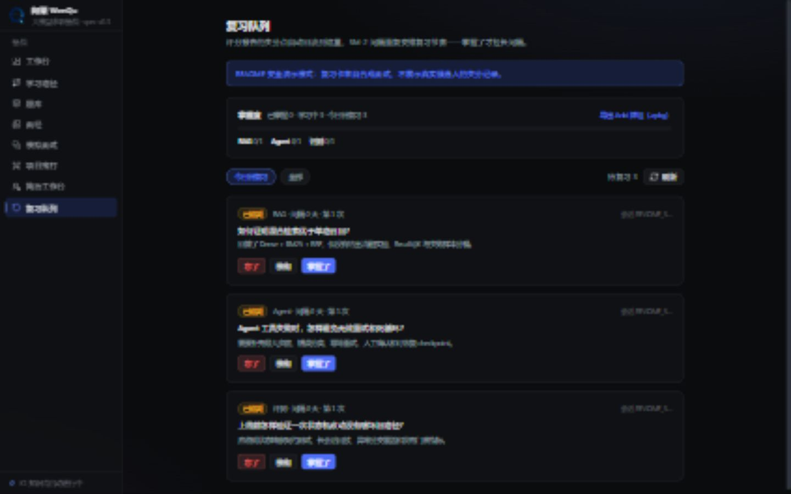</td>
  </tr>
  <tr>
    <td align="center"><sub>评分项 → 原话证据 → 具体失分点 → 复习建议</sub></td>
    <td align="center"><sub>忘了 / 模糊 / 掌握了，支持掌握度统计与 Anki 导出</sub></td>
  </tr>
</table>

## 工程边界

```text
apps/
  api/      FastAPI：知识管道、组卷、简历、报告、复习、Repository Intelligence
  agents/   Node + pi：mock / grill / answer 三类 Agent、Harness、SSE 会话与只读工具
  web/      Next.js：八个可独立进入的产品模块与浏览器语音适配

docs/       总规范、改进型 Spec、验收基线、README 视觉与截图规范
research/   数据渠道、开源面试 Agent、DeepSeek Harness 与仓库理解调研
scripts/    Windows 一键安装、启动、停止、状态与日志
```

核心原则是：**窄契约、显式失败、append-only 会话、幂等管道、可定位证据、本地数据不进 Git**。详细设计见 [总规范](docs/spec.md) 与 [改进型 Spec 索引](docs/improvement-specs/README.md)。

## 验收基线

最近一次完整验收：

- API：121 tests + Ruff；Agents：29 tests + typecheck；Web：5 tests + typecheck + production build。
- Tree-sitter：177/177 个受支持源码文件解析成功，370 个语法代码块，repo map 3,004 条引用边。
- pgvector：370 个真实代码块完成写入与 cosine 查询；fixture 向量只证明链路，不冒充真实语义质量。
- Git：公共 `itsdangerous` 仓库 15/15 个受支持源码解析，200 条提交历史完成归属分析。
- 三项服务健康检查均为 200。

详细证据：[G1 验收基线](apps/api/evals/g1-repository-intelligence-baseline.json) · [G1 v2 Spec](docs/improvement-specs/IMP-G1-001-repository-intelligence-v2.md) · [F3 面试与语音 Spec](docs/improvement-specs/IMP-F3-002-grounded-chinese-interview-and-voice.md)

> 当前唯一保留的发布环境门：配置真实 embedding Provider 后，用自然语言查询完成 Top-5 质量验收。没有 Provider 时功能会明确标记 unavailable，不静默降级成伪语义搜索。

## 快速开始

### 环境要求

| 依赖 | 版本 | 用途 |
|---|---|---|
| Docker Desktop | 近期版本 | PostgreSQL / pgvector、Meilisearch、Redis |
| Node.js | 22+ | Web 与 Agents |
| Python | 3.12+ | API |
| uv | 近期版本 | Python 依赖管理 |
| DeepSeek API Key | — | 面试、备课、评分等 LLM 能力 |

### Windows

```bat
git clone https://github.com/fjnuslw/WenQu.git
cd WenQu

setup.bat
:: 填写 apps/api/.env 与 apps/agents/.env
start.bat
```

打开 <http://127.0.0.1:23482>。状态检查、日志与停止：

```bat
status.bat
stop.bat
```

### macOS / Linux 手动启动

```bash
docker compose up -d

cd apps/api && uv sync
uv run uvicorn getoffer.api.main:create_app --factory --port 23480

cd ../agents && npm install && npm run dev
cd ../web && npm install && npm run dev
```

## 配置与数据边界

模板见 [apps/api/.env.example](apps/api/.env.example) 与 [apps/agents/.env.example](apps/agents/.env.example)。`.env`、数据库、上传简历和本地导入数据均被 Git 忽略。

| 配置 | 默认 / 说明 |
|---|---|
| `GETOFFER_LLM__API_KEY` | API 侧 LLM Key；为空时服务仍能启动，相关调用返回显式未配置 |
| `DEEPSEEK_API_KEY` | Agents 侧 Key，可与 API 侧复用 |
| `GETOFFER_TTS__PROVIDER` | `disabled` 或已配置的真实语音 Provider；浏览器语音是显式回退 |
| `GETOFFER_EMBEDDING__PROVIDER` | `disabled` 或 `openai_compatible`，与聊天模型完全分离 |
| `GETOFFER_GIT_PROXY` / `GETOFFER_COLLECT_PROXY` | 网络受限时填写代理 |

题库与面经需自行导入：

```bat
cd apps/api
uv run python scripts/import_source.py --all
uv run python scripts/backfill_company_freq.py
```

导入器幂等，License 门禁拒绝 GPL / AGPL / NC 内容进入库内。第三方内容的使用合规责任由使用者承担。

## 路线图

- [x] K1：题库、面经、标签、公司频率榜与合规导入
- [x] I1 / F3：简历证据化组卷、中文展示、追问阶梯、音色选择、评分回流
- [x] G1 v1：项目备课、只读工具、代码证据链报告
- [x] G1 v2：Tree-sitter repo map、pgvector 检索链路、Git 归属分析与动态能力注册
- [x] L1：SM-2、掌握度、Anki、JD 匹配
- [x] F7：五条学习路径、资源锚点、订阅与节点进度
- [x] README v2：全量新截图、合成数据安全模式、品牌封面与能力闭环图
- [ ] 发布环境门：真实 embedding Provider 自然语言 Top-5 质量验收

## 复用与致谢

Agent 运行时复用 [pi-agent-core / pi-ai](https://github.com/earendil-works/pi)（MIT）；设计思想参考 [DeepSeek Harness](https://github.com/deepseek-ai/deepseek-harness)、[deepwiki-open](https://github.com/AsyncFuncAI/deepwiki-open)、[The-Interview-Mentor](https://github.com/ps06756/The-Interview-Mentor) 与 aider repo map。

## License 与免责声明

[MIT License](LICENSE)。本项目是本地单用户 MVP，没有多租户认证与公开服务限流，请勿直接暴露到公网。AI 面试、评分、押题和项目拷打仅供训练参考；重要决策不要依赖单一模型输出。
